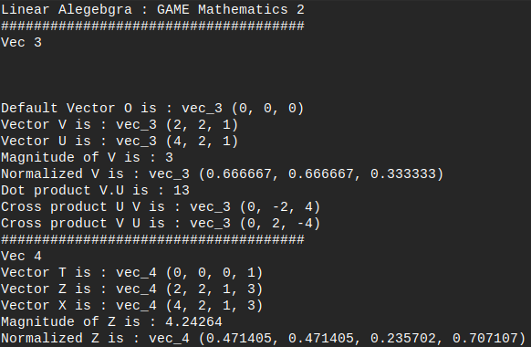
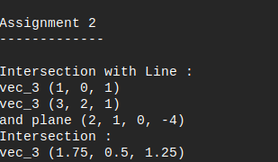
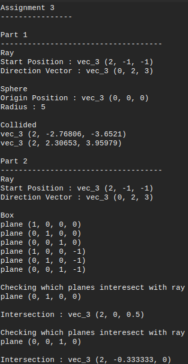

<h1>Linear Algebra</h1>

Introductory course to Linear Algebra, focusing on vector and matrix manipulation. The objective for this course was to represent 3D objects such as rays and planes using 3D vectors and transform matrices to scale, rotate, translate, and define orientation through quaternions.

<h2>Assignment - 1</h2>
	|-> Represent 2D and 3D vectors and mainpulate the value using custom math library

</img> 

<h2>Assignment - 2</h2>
	|-> Represent a ray and calculate the intersection point of a ray and line, and ray and plane.
	
</img> 

<h2>Assignment - 3</h2>
	|-> Detect collision point between ray and sphere, and ray and box
	
</img> 

<h2>Assignment - 4</h2>
	|-> Manipulate vectors orientiation though the use of quaternions
	
</img> 

