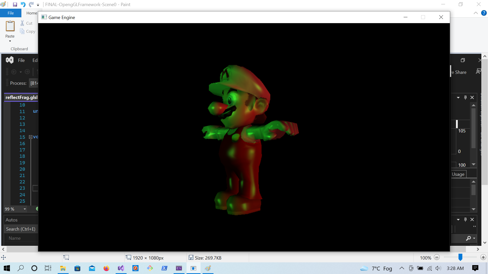
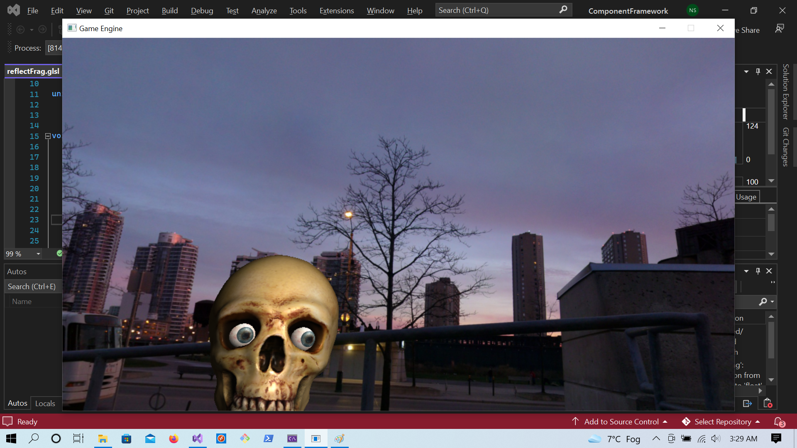
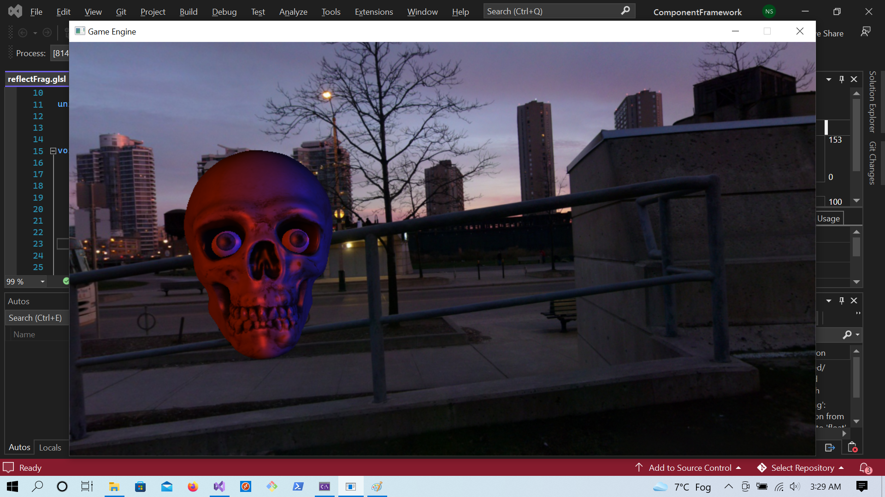
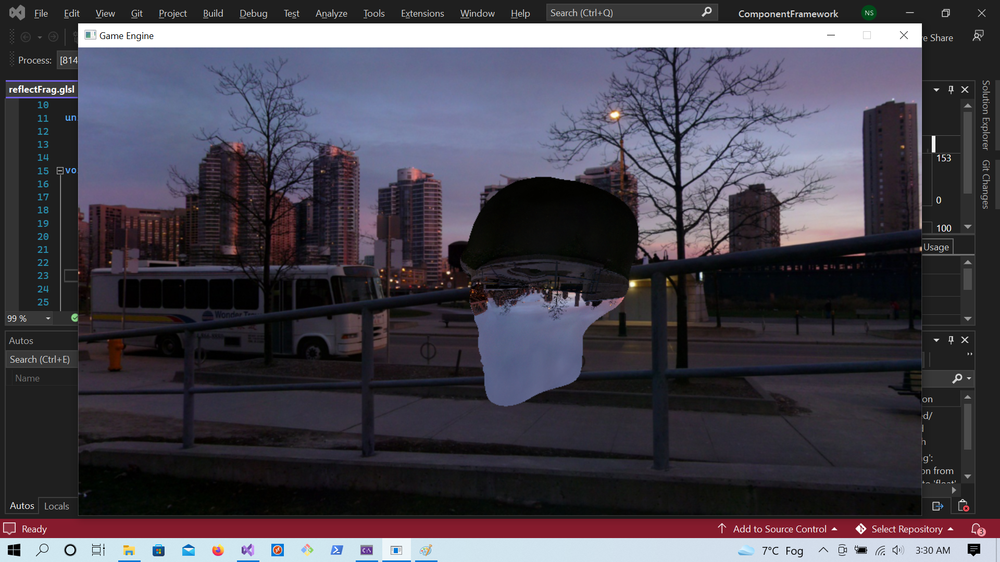
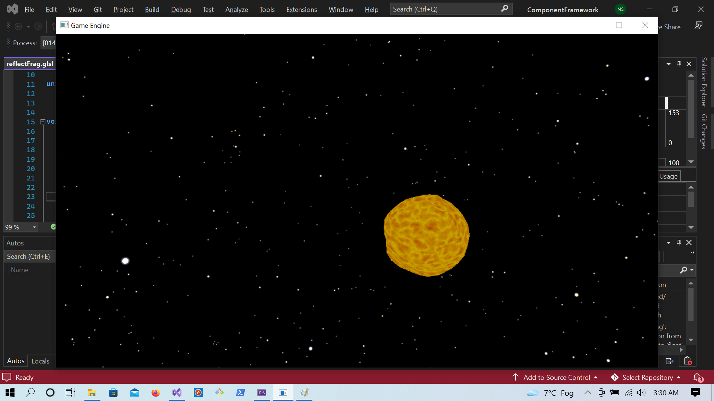

<h1>Graphics Programming</h1>

<h2>Scene1</h2> 

(10/15) Create a minimum of two lights in Scene1.cpp based on the Phong Shading model. This will require you to create two light positions in Scene1. Both of those positions need to be sent to the GPU as uniform variables. The phongVert.glsl and PhongFrag.glsl files need to be copied given new names. Of course the code inside those shaders will have to be modified to reflect the multiple light positions. I recommend using two different colours of lights postioned away from each other.

For added marks try the following: (Up to 5% more)
Extra: Store and pass the two light positions as arrays. The vertex shader will need to revieve the array.
Extra: Store and pass the muliple light positions as arrays. You will need to also pass the length of the array
Extra: Pass Diffuse and Spectular colour data from the CPU to the GPU. Using C structs? Ask me. 

</img> 

<h2>Scene2</h2>

In this assignment I would like you to place two eyes in the into the Skull.obj. The two eyes need to be parented to the skull such that when the head rotates the eyes move as well. You will need to implement the Trackball code to do the rotations or just use keyboard events. Be sure to scale the eyes to a reasonable size and translate them into the correct position.

</img> 

<h2>Scene3</h2>

Our next task is to build a Skybox sometimes refered to as an evironment map or a cub map.
The idea is that a cube could be created where all six faces had a texture assigned to it.
The camera, or eye, is still at the origin looking down the negative z-axis, if the cube is a 1x1x1, centered at the origin,
Smiley face
Wait! A better plan is to look at this web page skybox

In order to see if you have build the sky box correctly, you will need to contol the camera by keyboard or mouse. I suggeast using the mouse. You can get the rotation matrix out of the trackball with getMatrix4(). You should use it as the cameraRotationMatrix instead of the Camera's viewMatrix.

</img> 

<h2>Scene4</h2>

This next task is to put an object into the the skybox and create a mirror and a lens. I recommend starting with a sphere.
Build a sphere inside a skybox. Following the ideas found in the learnOpenGL website (not the code), build reflection and refaction shaders to make the sphere look like a mirrored ball. In refraction mode you should the a small inverted image if the condos in the background. For bonus marks, combine reflection and refraction to simulate Fresnel's equation of implement Fresnel's real equation. The bottom part of this link cubemaps

Your Scene should look something like this, with just reflection - the skull head does not need to move.

</img> 

<h2>Scene5</h2>

In this project I want you to bring in a sense of time into the shader.
In Scene 5, deltaTime is provided by the update() function. The total time (or a function of it) can be created by sum of the deltaTime. Using the noise code provided to the right create a sampler3D and pass it to the vertex shader.
In here you can modify the sphere's shape with something like this:

You could also bring the noise in to the fragment shader.
I used this system "art" math here to generate a mixing function on the surface to simulate turbulence.
This is just a code sample I got from an old out of date, early book on shaders. Google "Orange_Book_-_OpenGL_Shading_Language_2nd_Edition.pdf"
There are endless things you can create. The section on turbulence is fun - remember, it is way out of date. 

</img> 

