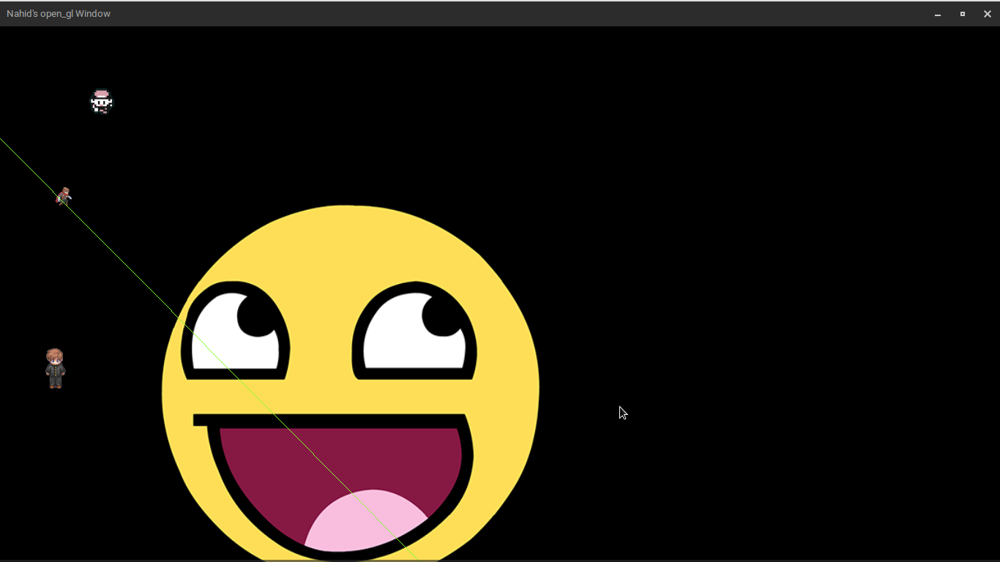
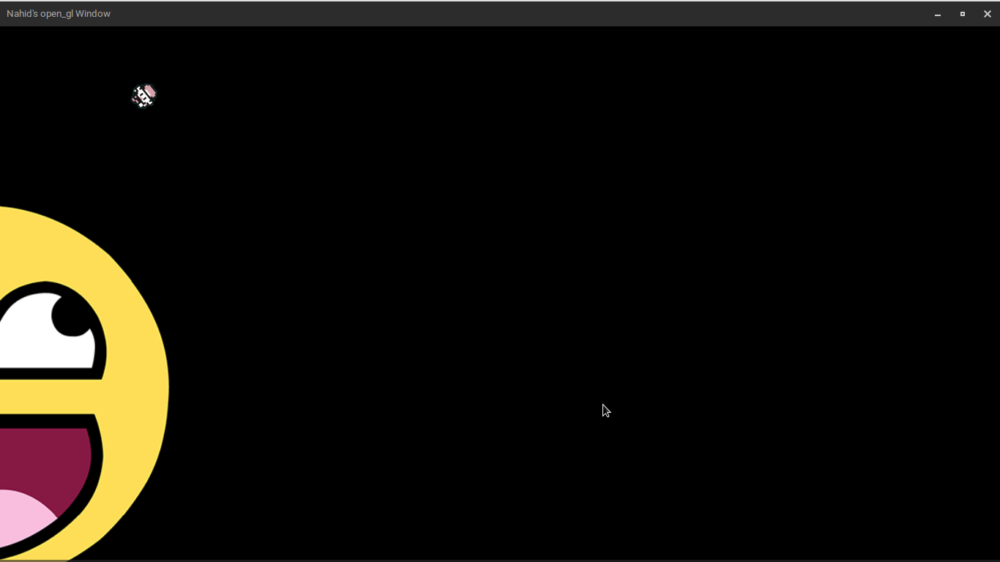
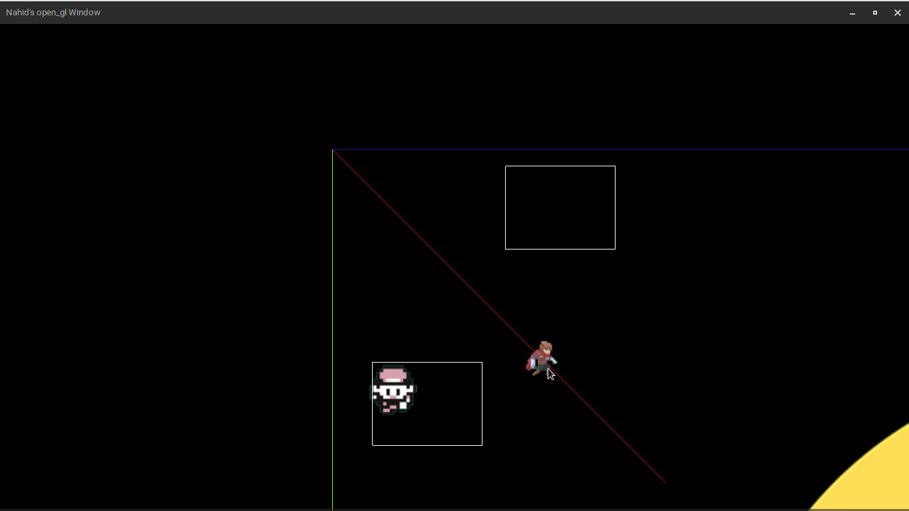
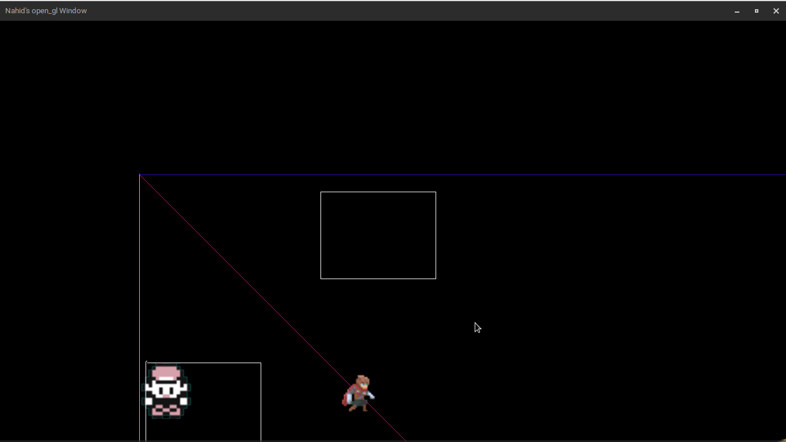
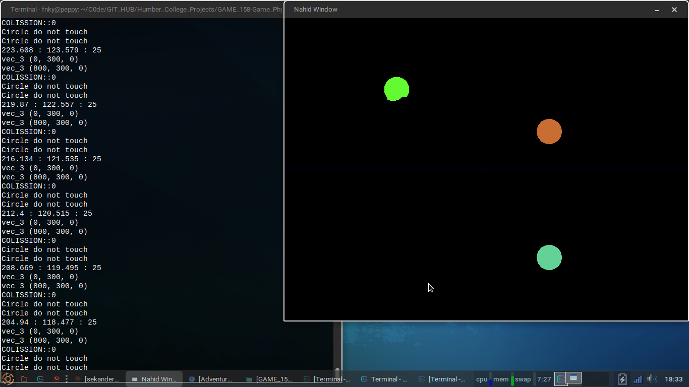
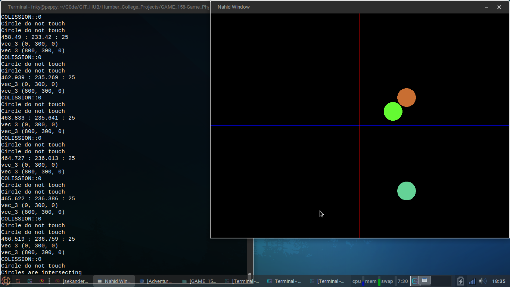
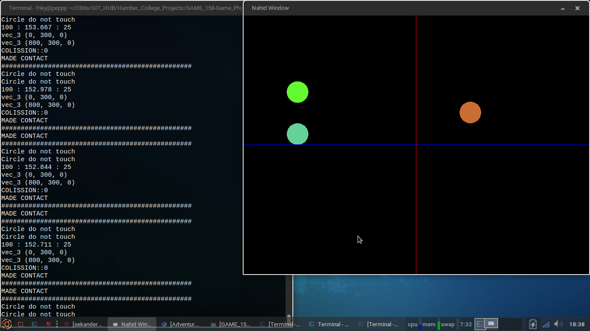
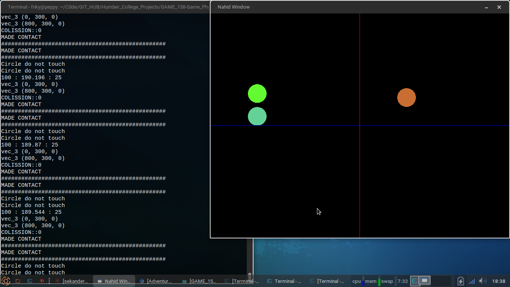
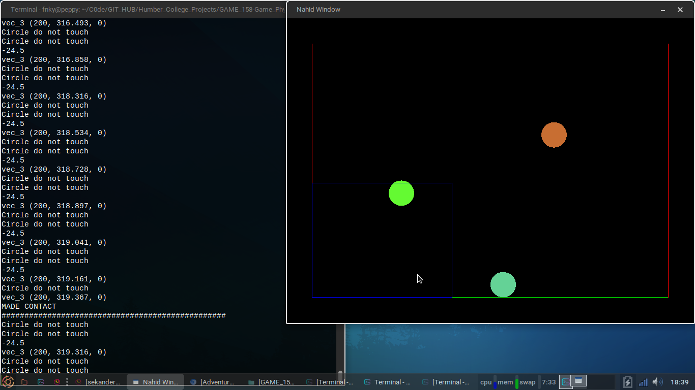
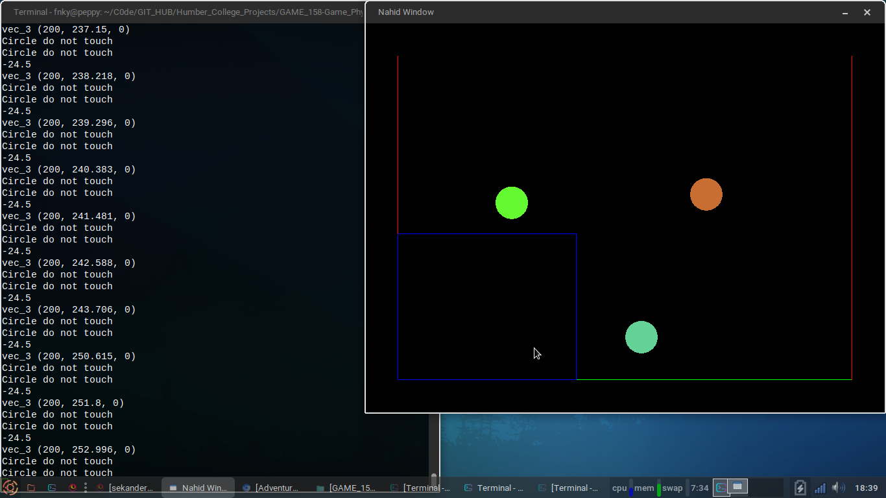

<h1>Game Physics 2</h1>

I built a custom 2D physics engine simulating Netwon's Laws and Netwon's equations of motion. The physics engine is capable of rotational motion calculating torque, and detecting collisions between 2D polygons.

Motion
|-> Applying Netwons equations of motion and simulating in 2D objects 

</img> 

</img> 

Collisions
|-> Detecting collisions between Axis-Aligned bounding box

</img>

</img>

Polygon_Test
|-> Testing collisions between spheres, lines and calculate elastisity between polygons and responce. 

</img>

</img>

</img>

</img>

Buyouncy
|-> Simulating buyouncy with 2D polygons 

</img>

</img>
	
	
