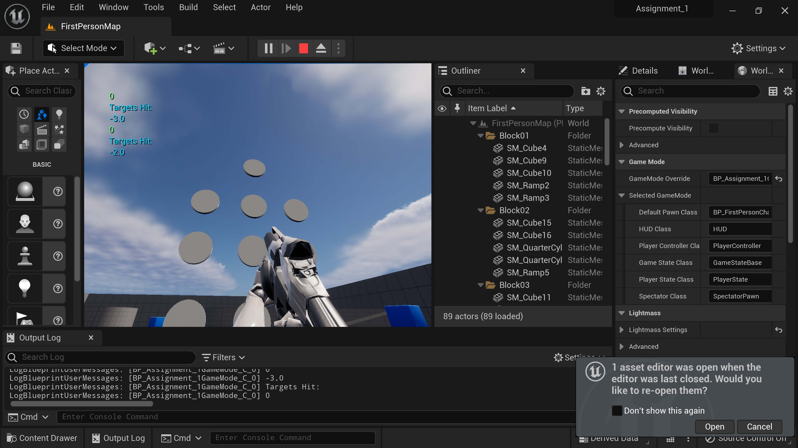
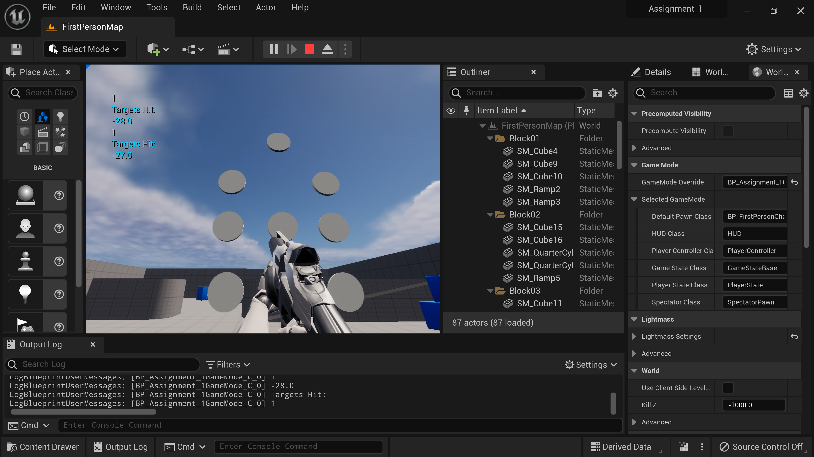
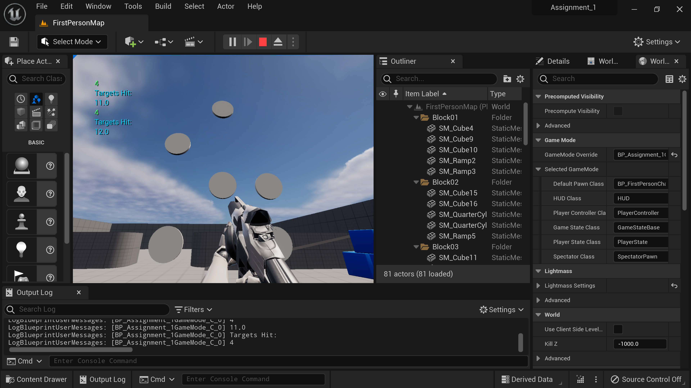

<h1>Game Engines 2 - Advanced Unreal</h1>

Creating 3D game prototypes using unreal to simulate collisons, animation,
basic artifiial intelligence and setting up application for multiplayer connectivity

<h2>Assignment_1</h2>
The task for this assignment was to modify the first-person shooter template to implement actor targets destroyed when a projectile collided using c++. In addition, a timer needs to be decremented and printed on the screen constantly. Once the target is destroyed, the timer will add 5.0 seconds. The functionality of this code was implemented in the Gamemode, so the target and the game mode can communicate.

</img>

</img>

</img>

