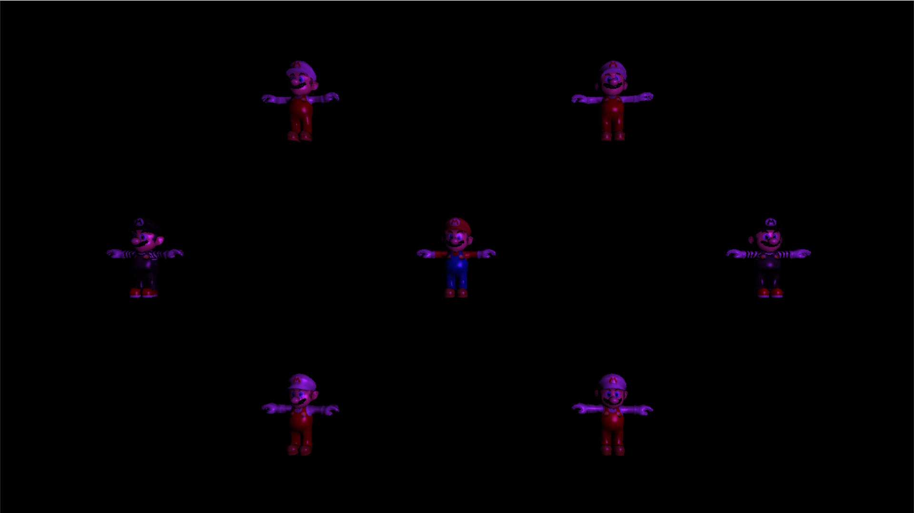
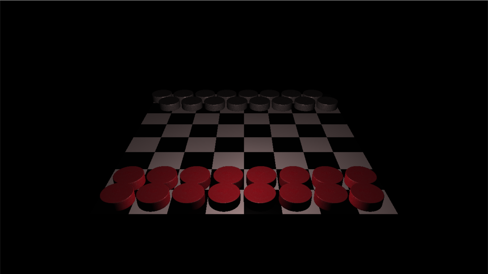

Game Engines 4 - Component Framework

Further expanding 3D graphics through the use of OpenGL focusing on reueusable code and smart pointers to easily manage and organize data used by the application. Learned how to use external files to load assets through the use of tinyXML.

Scene 0

</img> 

Scene 1

</img> 

