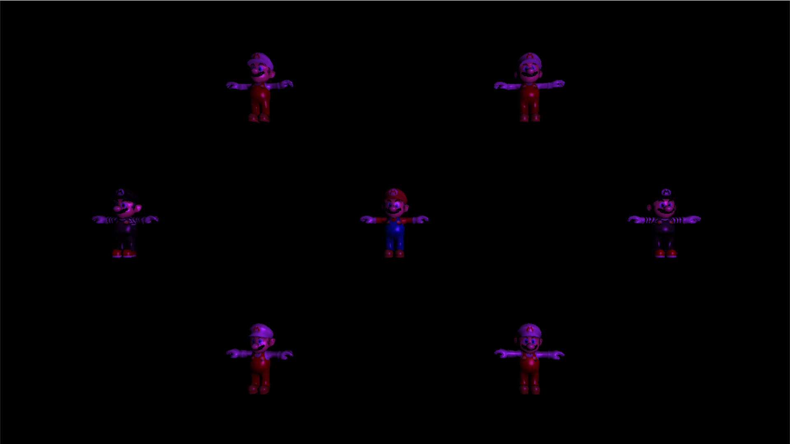
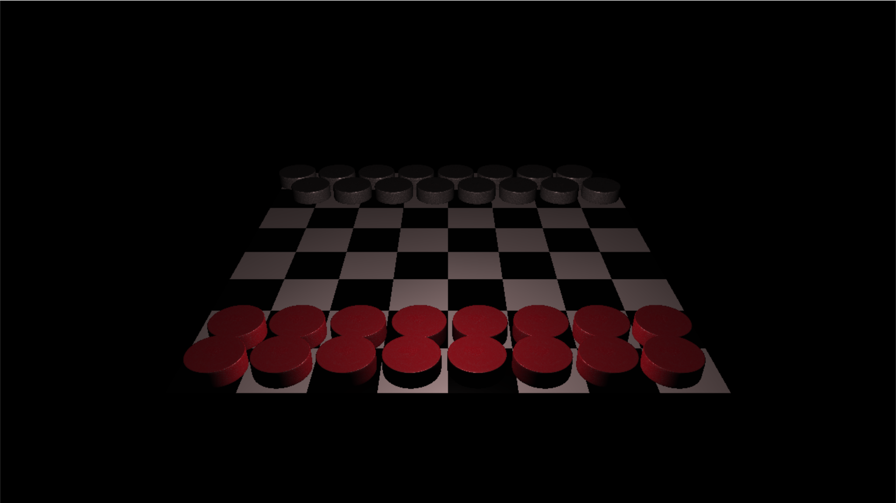

<h1>Game Engines 4 - Component Framework</h1>

Further expanding 3D graphics through the use of OpenGL focusing on reueusable code and smart pointers to easily manage and organize data used by the application. Learned how to use external files to load assets through the use of tinyXML, and incoprated Enity Component System(ECS) design model.

<h2>Scene 0</h2>
This assignment focused on loading 3D models through an XML parser. Each 3D model can be adjusted through an XML document updating the position and orientation without recompiling the code.

</img> 

<h2>Scene 1</h2>
The task for this assignment was to implement newly learned concepts and apply smart pointers and components. Adding components to the scene allows data to be organized, and any objects created would be automatically destroyed through a smart pointer, ensuring no memory leaks occur.

</img> 

