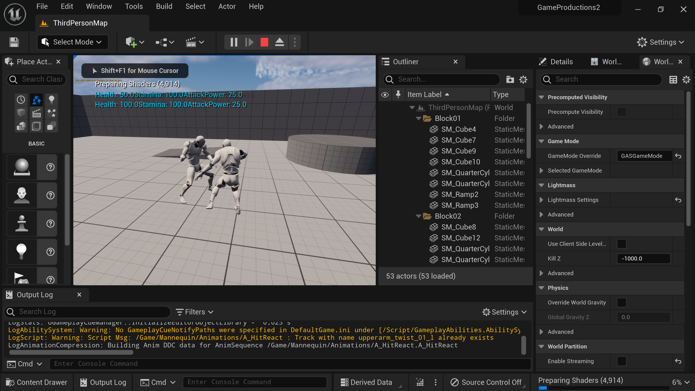
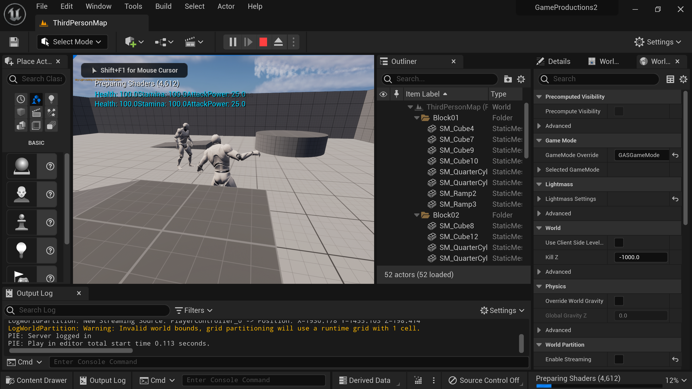

<h1>Game Productions 2</h1>

The goal of this course was to design and prototype a game created collaboratively by many students with different levels of skills and strengths. My responsibility was designing the combat mechanics and ensuring the code was compatible and useable with other teammates' code.

</img> 

</img> 

