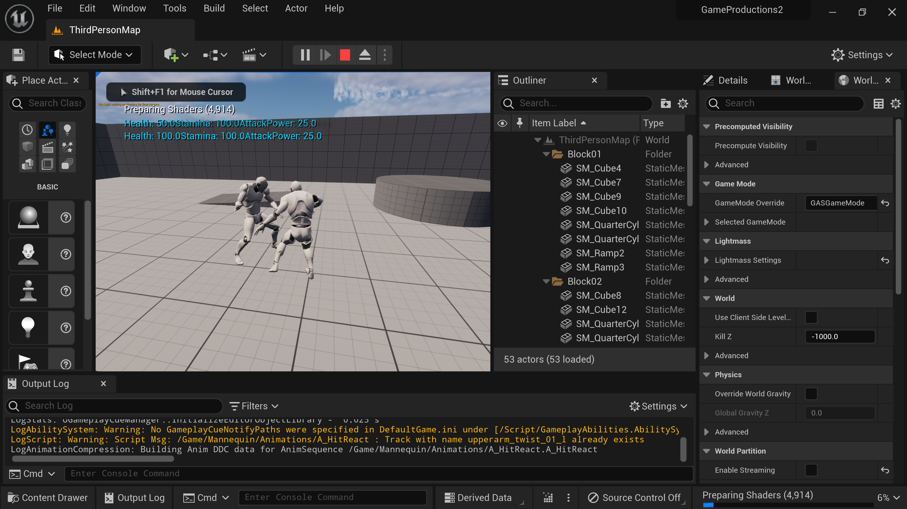

Game Productions 2

The goal of this course was to design and protype a game created collabarltlviely through many students with different level of skills and strengths. My responicibility was designing the combat mechnaices and making sure the code was compatible and useable other teamates code. 

</img> 

</img> 

