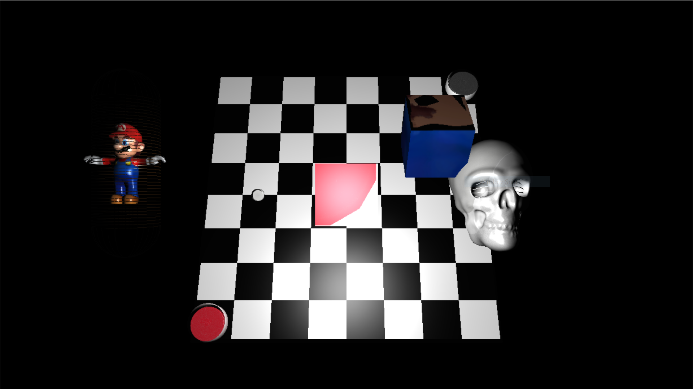
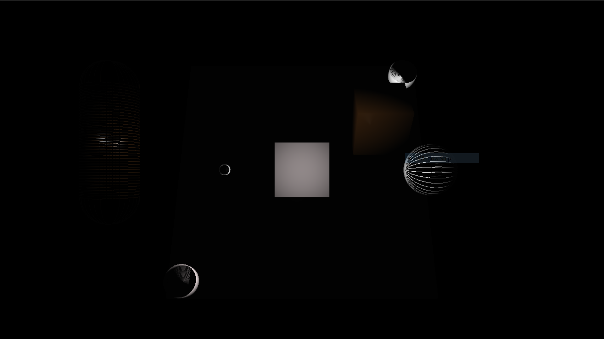
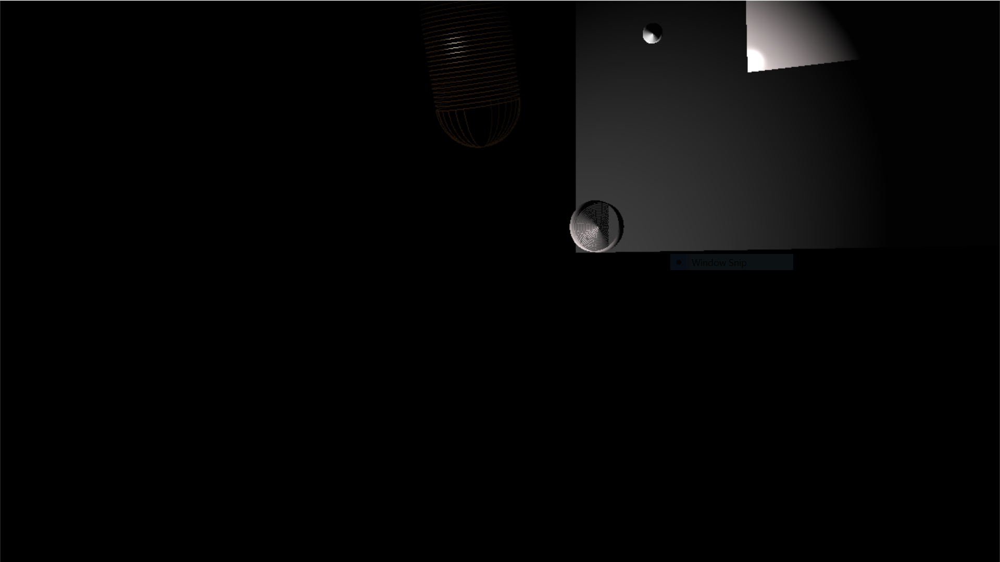
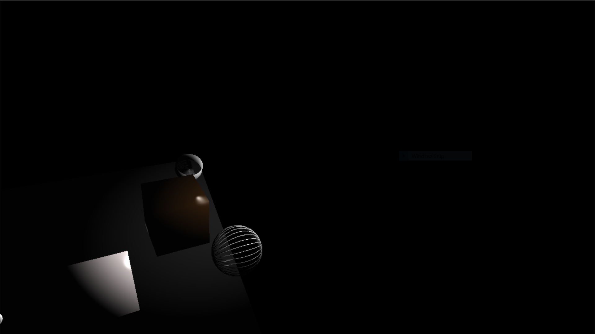

<h1>Game Physics 3</h1>
Gained an understanding how to create geometric primitive objects such as, cube, sphere, cylinder and capsule. Geometric primitives represents mesh to 3D models that were loaded into the scene such that the program can interact with the objects throguh ray casting. 

<h2>Assignment 1</h2>
Design and implement geometric primitives to represent mesh for 3D models loaded into the scene with given framework.  

</img> | </img> 

</img> | </img> 

<h2> Assignment 2</h2>
