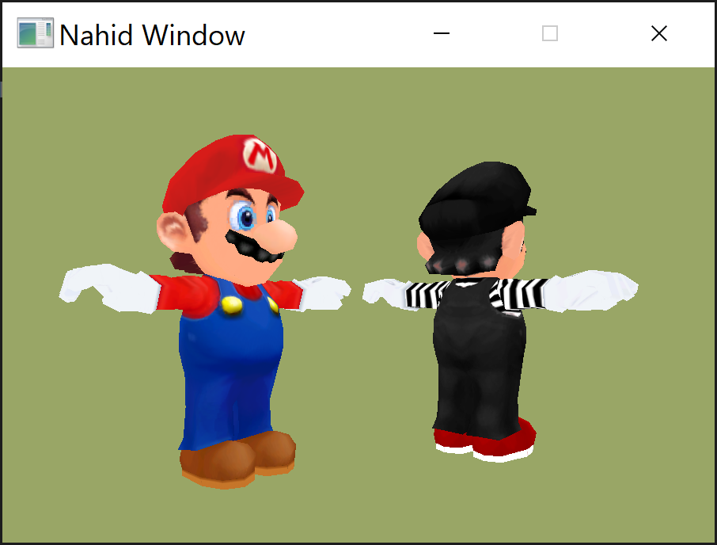

<h1>Game Engines 5 - Vulkan</h1>
Students create computer graphics in real time by executing code directly onto the Graphics Processing Unit (GPU) to exploit the advantages of parallel processing. Learners use a shading language to control the rendering process. Students implement shaders that could be used in their capstone project.

<h2>Assignment 1</h2>
Create a two light system. This will require you to modify the shaders and recompile the shaders. You will also need to modify the UBO on both the CPU and GPU to carry the lighing data.
Extra: Create a separate Uniform buffer to just handle lighting data.
Extra: Create more that two lights.
Extra: Pass the color of each light as a Uniform.

</img> 

<h2>Assignment 2</h2>
In this project I want you to use a push constant to shoot over Mario's model matrix to the pipeline (shader). The in-person class is still fighting with technical issues - sorry - I hate it too, video 5 is now uploaded. In this video I will try to explain the idea and mechanism of push constants.
Push are a slightly different way of passing data the shader. In fact, it is even faster than using uniform buffers. But, they do have a drawback, they are restricted to a maximum of 128 bytes of memory. Can you do a projection, view, and model maxtrix in 128 bytes? Quick answer, no. So the camera will remain a UBO.

Extra: It is stupid to calculate the normal matrix on the fly in the vertex shader with the transpose(inverse(of the modelmatrix). What? Calculate the normal matrix for every vertex in the model that's madness. Calculate the normal matrix (as a 4x4) on the CPU side and pass it in via the push constant, along with the normal matrix.

Extra: If you know too much, the normal matrix is just a rotation therefore really just a 3x3 matrix. However, alighnment rules need to be enforced. See std430 and std120 for details. It's just for you to show off.

</img> 

<h2>Assignment 3</h2>
Create a two different objects on the screen in the GPU and draw them. This means storing the data in separate vertex and index buffers.
Just create multiple pipelines, multiple objects and have the data downloaded to to the GPU. Store the descriptors as well
Extra: Create multiple textures on to the GPU.
Extra: Go ahead and draw multiple (more than two) objects

</img> 
