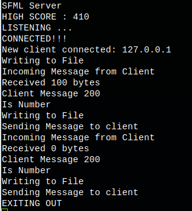

<h1>Computer Networking</h1>

Designed network programs using UDP and TCP protocols. Studied how to use blocking and non-blocking sockets and created a basic client/server model program. 

<h2> SFML Server </h2>
The SFML server continuosly listens for a connection, once a connection has been established the client will send the final score to the server and the server will output the score to a seperate file, which is then read by the server and submitted back to the client. 

</img> 

